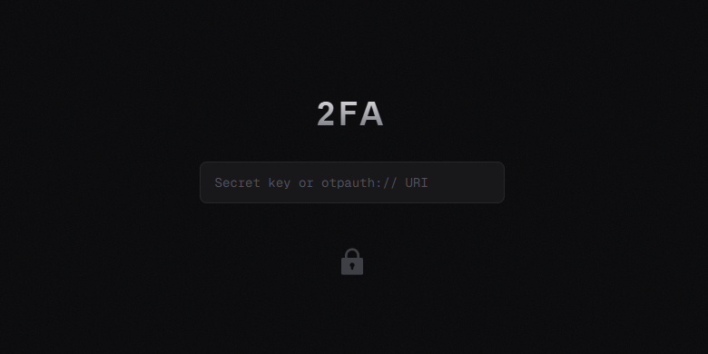

# 2FA Now

Minimalist TOTP 2FA code generator. Supports secret keys and `otpauth://` URIs with optional cloud sync via GitHub login.



[](https://vercel.com/new/clone?repository-url=https://github.com/sachnun/2fa-now&env=DATABASE_URL,AUTH_SECRET,AUTH_GITHUB_ID,AUTH_GITHUB_SECRET)

## Features

- Generate 6-digit TOTP codes
- Auto-detect labels from `otpauth://` URIs
- Click to copy codes
- Countdown timer until refresh
- Local storage (guest) or cloud sync (logged in)
- Dark mode support

## Tech Stack

Next.js 16 / React 19 / Tailwind CSS / NextAuth.js / Prisma / PostgreSQL

## Setup

### 1. Clone & Install

```bash
git clone https://github.com/sachnun/2fa-now.git
cd 2fa-now
npm install
```

### 2. Create PostgreSQL Database (Supabase)

1. Go to [supabase.com](https://supabase.com) and create a new project
2. Navigate to **Settings > Database**
3. Copy the **Connection string** (URI format)
4. Replace `[YOUR-PASSWORD]` with your database password

### 3. Create GitHub OAuth App

1. Go to [GitHub Developer Settings](https://github.com/settings/developers)
2. Click **New OAuth App**
3. Fill in:
   - **Application name**: `2FA Now` (or any name)
   - **Homepage URL**: `http://localhost:3000`
   - **Authorization callback URL**: `http://localhost:3000/api/auth/callback/github`
4. Click **Register application**
5. Copy **Client ID**
6. Click **Generate a new client secret** and copy it

### 4. Configure Environment Variables

Create `.env` file:

```env
DATABASE_URL="postgresql://postgres:[PASSWORD]@[HOST]:[PORT]/postgres"
AUTH_SECRET="your-random-secret-key"
AUTH_GITHUB_ID="your-github-client-id"
AUTH_GITHUB_SECRET="your-github-client-secret"
```

Generate `AUTH_SECRET`:
```bash
openssl rand -base64 32
```

### 5. Initialize Database

```bash
npx prisma migrate deploy
npx prisma generate
```

### 6. Run

```bash
npm run dev
```

Open [http://localhost:3000](http://localhost:3000)

## Production Deployment

Update GitHub OAuth App callback URL to your production domain:
```
https://yourdomain.com/api/auth/callback/github
```

## License

MIT
