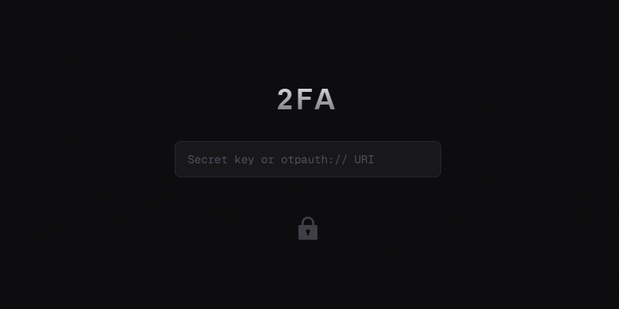

# 2FA Now

Minimalist TOTP 2FA code generator. Supports secret keys and `otpauth://` URIs with optional cloud sync via GitHub login.



[](https://vercel.com/new/clone?repository-url=https://github.com/sachnun/2fa-now&env=DATABASE_URL,AUTH_SECRET,AUTH_GITHUB_ID,AUTH_GITHUB_SECRET)

## Setup

```bash
git clone https://github.com/sachnun/2fa-now.git
cd 2fa-now
npm install
```

Configure `.env`:

```env
DATABASE_URL="postgresql://[USER]:[PASSWORD]@[HOST]/[DATABASE]?sslmode=require"
AUTH_SECRET="your-random-secret-key"
AUTH_GITHUB_ID="your-github-client-id"
AUTH_GITHUB_SECRET="your-github-client-secret"
```

Run:

```bash
npx prisma migrate deploy
npm run dev
```
